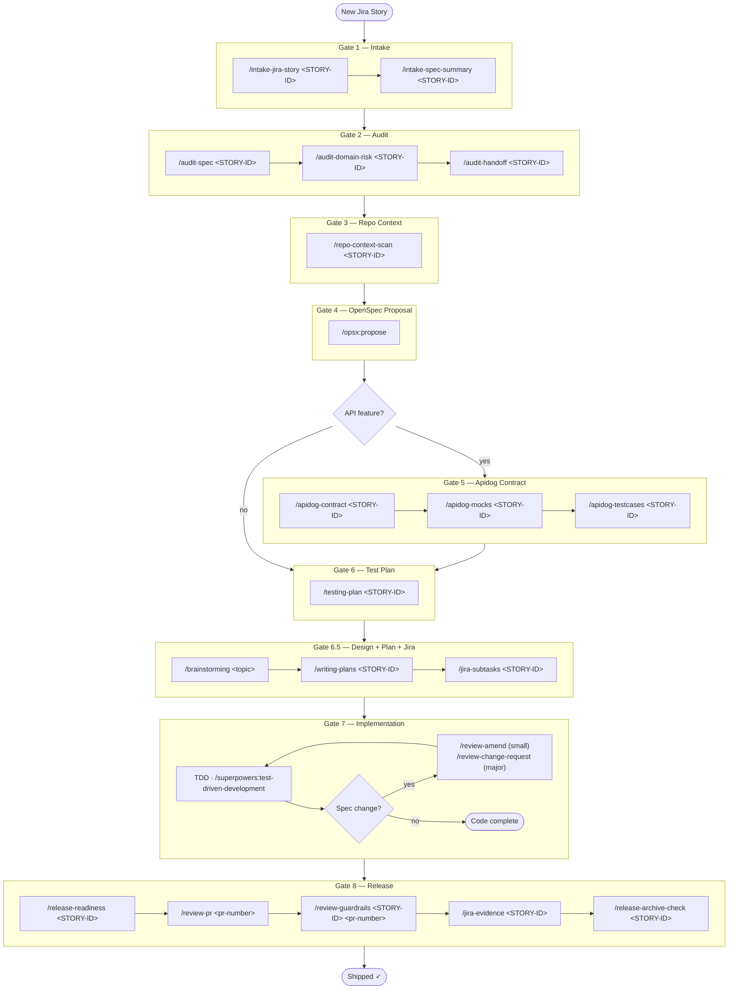

# agent-skills-setup

One-command setup for [Agent Skills](https://agentskills.io) across multiple AI agents and platforms.

Installs:
- **[OpenSpec](https://github.com/Fission-AI/OpenSpec)** — spec governance via `/opsx:propose`, `/opsx:apply`, `/opsx:archive` (npm package, auto-installed)
- **[superpowers](https://github.com/obra/superpowers)** — brainstorming, TDD, systematic debugging, code review, and more
- **Custom group skills** — five groups (`intake`, `jira`, `review`, `infra`, `utils`) wrapping the previous flat skills, organized for the [Spec-Gated Workflow](docs/migration.md)

Supports: Kiro, Claude Code, Gemini CLI · macOS, Linux, Windows

---

## Quick Start

**macOS / Linux / Git Bash:**
```bash
git clone https://github.com/herocwhsu/agent-skills-setup
cd agent-skills-setup
bash scripts/install.sh
bash scripts/setup-credentials.sh
```

**Windows 11 (native PowerShell):**
```powershell
git clone https://github.com/herocwhsu/agent-skills-setup
cd agent-skills-setup
.\scripts\install.ps1
.\scripts\setup-credentials.ps1
```

Restart your shell after setup.

---

## Spec-Gated Workflow

Every feature follows this gate sequence. No gate can be skipped silently — see Rule 13 in your CLAUDE.md.




## Post-install: OpenSpec setup Two additional steps are required before `/opsx:propose` and other OpenSpec slash commands will work.

**Step 1 — Initialize OpenSpec in each project:**
```bash
cd <your-project>
openspec init
```
Creates a `.openspec/` directory and installs `/opsx:*` slash-command skills into `.claude/` (or equivalent for other agents). Run once per project.

**Step 2 — Keep skills up to date:**
```bash
openspec update
```
Re-run after upgrading openspec to refresh the installed skills.

> **Note:** Skills are installed per-project into `.claude/skills/` — not globally. Run `openspec init` in every project where you want `/opsx:*` commands. Restart your IDE after running either command.

---

## Scripts

| Script | Platform | What it does |
|---|---|---|
| `scripts/install.sh` | macOS / Linux / Git Bash | Install superpowers + custom skills |
| `scripts/install.ps1` | Windows PowerShell | Same, native Windows |
| `scripts/uninstall.sh` | macOS / Linux / Git Bash | Remove installed skills |
| `scripts/update.sh` | macOS / Linux / Git Bash | `git pull` + re-install |
| `scripts/run-tests.sh` | macOS / Linux / Git Bash | Run all skill + script tests (`--fast` skips integration tests) |
| `scripts/setup-credentials.sh` | macOS / Linux / Git Bash | Store service credentials in keychain |
| `scripts/setup-credentials.ps1` | Windows PowerShell | Same, via Windows Credential Manager |

---

## Supported Agents

When prompted, choose one or more:

| # | Agent | Skills directory | Custom skills | Notes |
|---|---|---|---|---|
| 1 | Kiro | `~/.kiro/skills/` | ✓ | Also installs prompts to `~/.kiro/prompts/` |
| 2 | Claude Code | `~/.claude/skills/` | ✓ | |
| 3 | Gemini CLI | `~/.gemini/skills/` | ✓ | |
| 4 | All | all of the above | — | |

---

## Credential Setup

`setup-credentials.sh` (bash) and `setup-credentials.ps1` (PowerShell) manage credentials for multiple services. Passwords are stored in the platform keychain only — **never exported to env vars**.

**Required Credentials by Skill:**

| Group / Subcommand | Service | Required Key/Auth |
|---|---|---|
| `utils/polish-input` | **Gemini** / Anthropic | `GEMINI_API_KEY` (or Google ADC) / `ANTHROPIC_API_KEY` |
| `intake/web-page` | **Confluence** | REST API Token + User |
| `intake/jira-story` | **Jira** | REST API Token + User |
| `jira/subtasks` | **Jira** | (Uses same Jira credentials as above) |
| `utils/confluence-tree` | **Confluence** | (Uses same Confluence credentials as above) |

**Actions:** `add` · `update` · `delete` · `list` · `verify`

**Example: Add Gemini key for polish-input:**
```bash
bash scripts/setup-credentials.sh gemini add
```

**Example: Add Anthropic key (alternative):**
```bash
bash scripts/setup-credentials.sh anthropic add
```

**Verify a credential is stored (safe — value never printed):**
```bash
bash scripts/setup-credentials.sh confluence verify
```

**Platform storage:**

| Platform | Storage | Script |
|---|---|---|
| macOS | Keychain (`security`) | `setup-credentials.sh` |
| Linux (GUI) | GNOME Keyring (`secret-tool`) | `setup-credentials.sh` |
| Linux (headless/CI) | Inject via pipeline secret at use-time | — |
| Windows 11 | Credential Manager (`CredentialManager` PS module) | `setup-credentials.ps1` |

All entries are namespaced `agent-skills-setup:<service>` to avoid collisions with system or browser keychain entries.

**Windows note:** `setup-credentials.ps1` auto-installs the [`CredentialManager`](https://www.powershellgallery.com/packages/CredentialManager) module from PSGallery on first run.

---

## Adding a New Skill

The repo follows a **group-skill** layout: each group is one entry in
`registry.txt` and one folder under `skills/`. Subcommands live as peer
folders inside the group, each with its own `IMPL.md` (the long-form recipe)
plus any `lib/` and `tests/`.

```
skills/<group>/
  SKILL.md             # router: subcommand table, slash-command list
  <subcommand-a>/
    IMPL.md            # full bash recipe for /<group>-<subcommand-a>
    lib/...
    tests/...
  <subcommand-b>/
    IMPL.md
    lib/...
    tests/...
```

### Add a subcommand to an existing group

1. Create `skills/<group>/<new-subcommand>/IMPL.md` with the recipe.
2. Add a row to the subcommand table in `skills/<group>/SKILL.md`.
3. Run `bash scripts/install.sh` to redeploy. No registry change needed.

### Add a brand-new group

1. Create `skills/<group>/SKILL.md` (frontmatter `name: <group>` + subcommand
   table) plus at least one `<subcommand>/IMPL.md`.
2. Add `local <group>` to `registry.txt`.
3. Run `bash scripts/install.sh`.

The install script only manages skills listed in `registry.txt` — all other
skills in your agent's skills directory are left untouched.

For a full migration map between the previous flat layout and these groups,
see [`docs/migration.md`](docs/migration.md).

---

## Always-On Engineering Rules (AGENTS.md style)

For cross-cutting rules that should be loaded **on every session** (not invoked on demand like a skill), use `agents/engineering-rules.md` and the `install-agents-md.sh` deploy script. The script writes the rules into a marked block inside each host file:

| Tool | Host file |
|---|---|
| Claude Code | `~/.claude/CLAUDE.md` |
| Gemini CLI | `~/.gemini/GEMINI.md` |
| Kiro | `~/.kiro/steering/engineering-rules.md` |

```bash
bash scripts/install-agents-md.sh             # Claude + Gemini + Kiro
bash scripts/install-agents-md.sh --claude    # Claude only
bash scripts/install-agents-md.sh --gemini    # Gemini only
bash scripts/install-agents-md.sh --kiro      # Kiro only
bash scripts/install-agents-md.sh --uninstall # strip from all
```

Or chain it onto the main installer with `--with-agents-md`:

```bash
bash scripts/install.sh --with-hook polish-input --with-agents-md
bash scripts/uninstall.sh --with-hook polish-input --with-agents-md
```

The `--with-agents-md` flag deploys to Claude, Gemini, and Kiro simultaneously. The script is **idempotent**: re-running replaces the block in place, leaving other content in the host file untouched. Edit `agents/engineering-rules.md`, re-run, and all three tools pick up the change on next session.

---

## Custom Skills

The five group skills (`intake`, `jira`, `review`, `infra`, `utils`) cover
intake, planning, code review, infrastructure, and miscellaneous utilities.
Each group's `skills/<group>/SKILL.md` is the entry point; per-subcommand
recipes live in `skills/<group>/<subcommand>/IMPL.md`.

For example:

- `intake/web-page` — fetch any URL (Confluence-aware) as a dated markdown reference
- `intake/jira-story` — fetch a Jira issue + every embedded link into `./docs/stories/<JIRA-ID>-<slug>/`
- `review/pr` — review one PR using a mined `.code-review/playbook.md`
- `utils/polish-input` — install a UserPromptSubmit hook for English prompt polishing

See [`docs/migration.md`](docs/migration.md) for the full mapping from the
previous flat-skill layout.

> **Claude Code users:** Sub-skill invocations use the `Skill` tool (e.g.
> `Skill("superpowers:brainstorming")`). The `html2md.py` converter is
> auto-detected from whichever agent skills directory is present
> (`~/.kiro/skills/intake/web-page/`, `~/.claude/skills/intake/web-page/`,
> etc.), with a fallback to the legacy `fetch-page-to-markdown/` path for
> previously installed agents.

---

## Requirements

Python 3 is required at install time (used by `install-agents-md.sh` for block rewriting and by `install_kiro_agent_config` for JSON validation). It is also required at runtime for fetch/confluence/polish skills.

The install script needs `bash` + one of `curl`/`wget` for downloading GitHub-sourced skills.

`pip` is used to install superpowers if available; otherwise the script falls back to downloading directly from GitHub — no pip required.

**Windows limitations:** `update.sh`, `run-tests.sh`, and `install-agents-md.sh` are bash-only. Windows users should use Git Bash for these scripts or run them manually after `git pull`.
