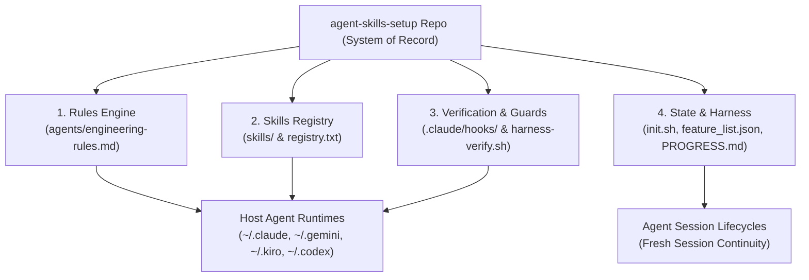

# System Architecture & Design

This document describes the architectural design, subsystem boundaries, data flow, and invariants of the `agent-skills-setup` repository.

---

## 1. System Overview

`agent-skills-setup` is a multi-agent harness and skill distribution engine. It configures AI coding agents (Claude Code, Antigravity CLI / agy, Kiro, Codex CLI) across macOS and Linux with standardized engineering rules, progressive-disclosure skill packs, defensive verification hooks, and continuous state tracking.



---

## 2. Core Subsystems

### 2.1 Rules Distribution Engine
- **Source of Truth:** `agents/engineering-rules.md` (defines 12 core engineering rules across Karpathy's principles and production guardrails, plus personal conventions and workflow policies).
- **Installer:** `scripts/install-agents-md.sh`.
- **Mechanism:** Injects and updates delimited blocks (`<!-- BEGIN agent-skills-setup:engineering-rules --> ... <!-- END agent-skills-setup:engineering-rules -->`) in host configuration files:
  - Claude Code: `~/.claude/CLAUDE.md`
  - Antigravity / Gemini: `~/.gemini/GEMINI.md`
  - Kiro: `~/.kiro/steering/rules.md`
  - Codex CLI: `~/.codex/instructions.md`
- **Invariant:** Target files are updated idempotently without overwriting user-defined custom instructions outside the markers.

### 2.2 Skills & Progressive Disclosure Architecture
- **Skill Structure:** Each skill is a self-contained directory under `skills/<group>/` governed by progressive disclosure:
  - `SKILL.md`: Level-1 discovery metadata, YAML frontmatter (`name`, `description`), and routing instructions.
  - Subcommands / Sub-skills: Level-2 detailed implementation (`IMPL.md`), executable scripts, and references.
  - Format standards: Format A (subcommand routing) and Format B (topic routing).
- **Registry:** `registry.txt` enumerates all bundled and external skill sources, mapping group names to source URLs or local paths.
  - Supports commit SHA pinning (`owner/repo@<commit-sha>`) to prevent silent upstream drift.
- **Distribution:** `scripts/install.sh` symlinks local skill groups directly into active agent skill directories (e.g. `~/.claude/skills/`, `~/.gemini/skills/`), allowing immediate edits during development without manual copying.

### 2.3 Verification & Guardrails Subsystem
- **On-Demand Entrypoint:** `scripts/harness-verify.sh` runs all repository gates and returns a single unified exit code (0 for pass, 1 for fail).
- **Stop / SubagentStop Hooks:** Located in `.claude/hooks/`. Prevent agents from ending a turn or exiting subagents in an inconsistent state:
  - `registry-guard.sh`: Enforces `registry.txt` syntax, path resolution, and type tags.
  - `types-guard.sh`: Whole-repo `mypy` type validation against `.python-version` (3.14.7). Fails loud on version drift or broken `.venv`.
  - `tests-guard.sh`: Delegates to `scripts/run-tests.sh` to run the full test suite.
  - `skill-paths-guard.sh`: Validates YAML frontmatter, directory linkages, and cross-references.
  - `credential-backend-guard.sh`: Validates credential helper configurations and scripts.
  - `hook-wiring-guard.sh`: Asserts that configured hooks in `.claude/settings.json` accurately match actual files.
  - `state-layer-guard.sh`: Ensures repository state artifacts (`init.sh`, `feature_list.json`, `PROGRESS.md`) exist and parse.
  - `secret-scan.sh`: Scans for committed secrets (gitleaks) and vulnerable dependencies (osv-scanner).
- **Tool-Event Hooks:** Immediate feedback hooks wired in `.claude/settings.json`:
  - `precommit-sh-check.sh` (PreToolUse on Bash): Validates shell scripts before commit commands.
  - `sh-check.sh` & `py-check.sh` (PostToolUse on Edit/Write): Immediate syntax and lint checks on touched shell/Python files.
  - `commit-evidence.sh` (UserPromptSubmit): Context injection for commit evidence trails.
- **Hook Exit Protocol:** Stop hooks exit with status code **2** to block agent turn termination and surface stdout/stderr directly into agent context.

### 2.4 State Management & Session Continuity
- **Startup Entrypoint:** `init.sh` runs initial checks and executes `scripts/harness-verify.sh`.
- **System of Record Artifacts:**
  - `feature_list.json`: Structured JSON catalog of all repository capabilities, statuses (`done`, `in-progress`, `planned`), dependencies, and test evidence.
  - `PROGRESS.md`: Human- and agent-readable log detailing current focus, resolved findings, and immediate next steps.
  - `AGENTS.md`: Repository-specific agent instructions, execution boundaries, and definition of done.

---

## 3. Directory Layout

```
.
├── AGENTS.md                  # Root agent instructions & operational boundaries
├── PROGRESS.md                # Session continuity & progress log (canonical standard)
├── feature_list.json          # Machine-readable feature catalog and test evidence
├── init.sh                    # One-command harness startup & verification
├── pyproject.toml             # Python project manifest & build configuration
├── requirements-dev.txt       # Frozen development dependencies
├── .python-version            # Pinned runtime version (3.14.7)
├── agents/                    # Rules shipped to target agent hosts
│   └── engineering-rules.md   # The 13 core engineering rules
├── config/                    # Shared configurations and templates
├── docs/                      # Architectural, educational, and design documentation
│   ├── architecture.md        # Canonical system architecture (this document)
│   └── harness-creator/       # Harness engineering training records & audits
├── hooks/                     # Template hooks distributed to agent environments
├── .claude/
│   ├── hooks/                 # Verification guard scripts
│   └── settings.json          # Permissions & hook registrations
├── scripts/                   # CLI tools, installer, test runners, validators
│   ├── harness-verify.sh      # Unified verification gate runner
│   ├── install.sh             # Main installer and symlinker
│   ├── install-agents-md.sh   # Rules injector
│   └── run-tests.sh           # Test suite runner
├── skills/                    # Custom skill definitions (15 groups)
└── tests/                     # Test suites (Bash, Python, integration)
```

---

## 4. Architectural Invariants & Constraints

1. **Bash 3.2 Portability Floor:**
   - All shared shell scripts must execute on macOS default `/bin/bash` (3.2.57) as well as Linux modern Bash (5.x).
   - Prohibited: Bash 4+ features (`declare -A`, `mapfile`, `readarray`, `;&`).

2. **Isolated Tooling & Zero Version Drift:**
   - Python code must execute under Python 3.14.7.
   - Verification guards (`types-guard.sh`, `run-tests.sh`) resolve tools through `.venv/bin/` and fail loud if `.venv` does not match `.python-version`. Silent fallback to arbitrary ambient interpreters is prohibited.

3. **Defensive Boundary Restrictions:**
   - Direct writes to `AGENTS.override.md` under home directories are denied via `.claude/settings.json`.
   - Running `init-repo.sh` targeting this repo is prohibited (destroys hooks).
   - `scripts/install.sh` refuses execution from non-main branches or detached worktrees unless `--allow-non-main` is explicitly provided.
   - Test suites modifying agent configurations must isolate `$HOME` to temporary directories.

4. **Repository as the Sole System of Record:**
   - Cross-session state lives exclusively in repository files (`feature_list.json`, `PROGRESS.md`), never in transient conversational memory.
   - A change is considered complete only when `./init.sh` exits 0.
