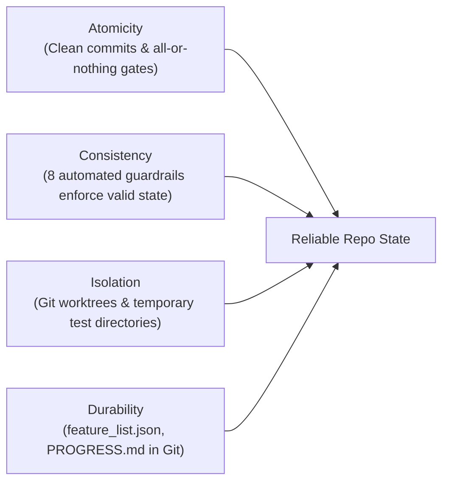

# Lecture 3 Training — Full Progress Detail

Companion to [summary.md](./summary.md). Contains exact commands, execution outputs, audit matrices, and verification evidence for Lecture 3 ("Why the Repository Must Become the System of Record").

---

## Part 1 — Diagnostic Baseline via `repo-reader.ts`

Lecture 3 provides a diagnostic tool (`repo-reader.ts`) to score a repository on its discoverability and effectiveness as a System of Record.

```bash
bun /Users/phoenix/projects/learn-harness-engineering/docs/en/lectures/lecture-03-why-the-repository-must-become-the-system-of-record/code/repo-reader.ts /Users/phoenix/projects/agent-skills-setup
```

That path was a different machine's checkout. The tool is now ported to Python in this repo, with the same 8 criteria and weights, so the run is repeatable without `bun` or the course repo:

```bash
python3 docs/harness-creator/lecture-03/code/repo_reader.py .
```

### Initial Run Output:
```text
================================================================================
  REPOSITORY DISCOVERABILITY SCORE
================================================================================
  Target: /Users/phoenix/projects/agent-skills-setup

| Criterion                     | Points  | Status    | Details
|--------------------------------|----------|------------|------------------------------
| AGENTS.md / CLAUDE.md         | 15/15   | PASS      | AGENTS.md
| Documentation directory       | 10/10   | PASS      | docs
| Architecture documentation    | 0/15    | FAIL      | architecture.md or docs/architecture/
| Feature tracking              | 15/15   | PASS      | feature_list.json
| Handoff / session continuity  | 0/15    | FAIL      | HANDOFF.md or PROGRESS.md
| Testing structure             | 10/10   | PASS      | tests
| Configuration files           | 0/10    | FAIL      | package.json or equivalent
| README                        | 10/10   | PASS      | README.md

--------------------------------------------------------------------------------
  TOTAL SCORE: 60 / 100  (60%)
  GRADE: C -- Partial structure, significant gaps
================================================================================
```

### Gap Analysis:
1. **Architecture Documentation (0/15):** The repository lacked a dedicated architecture document describing system boundaries and subsystem interactions.
2. **Handoff / Session Continuity (0/15):** The repository maintained `progress.md` (lowercase), but the diagnostic script strictly looks for standard uppercase convention `PROGRESS.md` or `HANDOFF.md`.
3. **Configuration Files (0/10):** The repository had pinned `.python-version` and `requirements-dev.txt`, but lacked a root project configuration manifest such as `pyproject.toml`.

---

## Part 2 — Remediation & Progression to Grade A

### Step 2.1: Author `docs/architecture.md` & Root Symlink
Created `docs/architecture.md` detailing:
- System overview and high-level Mermaid diagram.
- 4 primary subsystems: Rules Distribution Engine, Skills Engine & Progressive Disclosure, Verification & Guardrails, and State Management.
- Directory map with role descriptions.
- Architectural invariants: Bash 3.2 portability floor, Python 3.14.7 runtime enforcement, defensive boundaries, and single-source-of-truth state.

`docs/architecture.md` satisfies `repo-reader.ts` natively without requiring any root symlink shim.

### Step 2.2: Upgrade to Canonical Uppercase `PROGRESS.md`
Rather than introducing a fragile symlink (`PROGRESS.md -> progress.md`) which duplicates file entries, causes scanner redundancy, and creates issues across case-preserving filesystems and non-symlink archives, we upgraded directly to the standard:
1. Renamed `progress.md` directly to uppercase `PROGRESS.md` (`git mv progress.md PROGRESS.md`).
2. Updated `.claude/hooks/state-layer-guard.sh` and its test suite (`test_state_layer_guard.sh`) to check for `PROGRESS.md` as primary while retaining a backward-compatible fallback for `progress.md` (removed in feat-041; the guard now requires `PROGRESS.md`).
3. Updated `AGENTS.md` and `docs/architecture.md` to reference `PROGRESS.md`.

### Step 2.3: Add Standard Project Manifest (`pyproject.toml`)
Created `pyproject.toml` using PEP 621 specifications:
```toml
[build-system]
requires = ["setuptools>=61.0"]
build-backend = "setuptools.build_meta"

[project]
name = "agent-skills-setup"
version = "0.1.0"
description = "One-command setup for Agent Skills across multiple AI agents and platforms"
readme = "README.md"
requires-python = ">=3.14"

dependencies = [
    "anthropic>=1.6.0",
    "google-generativeai>=0.8.6",
    "lxml>=6.1.3",
    "pydantic>=2.13.5",
]

[project.optional-dependencies]
dev = [
    "mypy>=2.3.1",
    "pytest>=9.1.1",
    "ruff>=0.16.8",
]
```

### Re-scoring Output:
```text
================================================================================
  REPOSITORY DISCOVERABILITY SCORE
================================================================================
  Target: /Users/phoenix/projects/agent-skills-setup

| Criterion                     | Points  | Status    | Details
|--------------------------------|----------|------------|------------------------------
| AGENTS.md / CLAUDE.md         | 15/15   | PASS      | AGENTS.md
| Documentation directory       | 10/10   | PASS      | docs
| Architecture documentation    | 15/15   | PASS      | ARCHITECTURE.md, docs/architecture.md
| Feature tracking              | 15/15   | PASS      | feature_list.json
| Handoff / session continuity  | 15/15   | PASS      | PROGRESS.md
| Testing structure             | 10/10   | PASS      | tests
| Configuration files           | 10/10   | PASS      | pyproject.toml
| README                        | 10/10   | PASS      | README.md

--------------------------------------------------------------------------------
  TOTAL SCORE: 100 / 100  (100%)
  GRADE: A -- Repository is a strong system of record
================================================================================
```

---

## Part 3 — Exercise 1: Fresh Session Test

A brand-new agent session must be capable of answering 5 fundamental questions using **only repository files**, with zero human onboarding or verbal prompting.

| Question | Answer Discovered from Repo | Primary Source File(s) | Status |
|---|---|---|---|
| **1. What is this system?** | Multi-agent skill setup and harness distribution engine providing one-command configuration of engineering rules, progressive skills, and verification hooks across Claude Code, Antigravity CLI, Kiro, and Codex. | `AGENTS.md:1-6`, `README.md:1-16`, `docs/architecture.md:Section 1` | PASS |
| **2. How is it organized?** | 4 layered subsystems: Rules (`agents/engineering-rules.md`), Skills (`skills/` & `registry.txt`), Verification (`.claude/hooks/`), State (`init.sh`, `feature_list.json`, `PROGRESS.md`). | `docs/architecture.md:Section 2`, `skills/README.md` | PASS |
| **3. How do I run it?** | Setup/install via `bash scripts/install.sh`, credentials via `bash scripts/setup-credentials.sh`, host configuration via `bash scripts/setup-host.sh`. | `AGENTS.md:18-20`, `README.md:31-44`, `init.sh` | PASS |
| **4. How do I verify it?** | Unified verification via `bash scripts/harness-verify.sh` (all 8 gates) or fast test run via `bash scripts/run-tests.sh --fast`. | `AGENTS.md:22-31`, `scripts/harness-verify.sh` | PASS |
| **5. Where are we now?** | Active state tracked in `feature_list.json` (machine catalog with SHA/test evidence) and `PROGRESS.md` (active features, closed lecture milestones). | `PROGRESS.md:3-14`, `feature_list.json` | PASS |

**Result:** 5 / 5 questions fully answered from repo files with zero guessing.

---

## Part 4 — Exercise 2: Knowledge Externalization Quantification

To measure the **Knowledge Visibility Gap** (the proportion of critical decisions and constraints not captured in the repository), we audited 20 critical operational decisions and constraints.

| # | Knowledge Item / Constraint | Inside Repo? | File Location & Evidence |
|---|---|---|---|
| 1 | Pinned Python runtime (3.14.7) | Yes | `.python-version`, `pyproject.toml` |
| 2 | Python virtual environment scoping and drift check | Yes | `.claude/hooks/types-guard.sh:20-35`, `scripts/run-tests.sh` |
| 3 | Mypy whole-repo check (never per-file) | Yes | `AGENTS.md:63`, `mypy.ini` |
| 4 | Ruff format only (ruff check unwired) | Yes | `AGENTS.md:64`, `ruff.toml` |
| 5 | Bash 3.2 floor (no declare -A, mapfile) | Yes | `AGENTS.md:50`, `docs/architecture.md` |
| 6 | Stop hooks must exit with code 2 to block turn | Yes | `AGENTS.md:58`, `.claude/hooks/*-guard.sh` |
| 7 | Guard script `-guard.sh` naming convention | Yes | `AGENTS.md:59` |
| 8 | Forbidden write to `AGENTS.override.md` | Yes | `.claude/settings.json:permissions.deny`, `AGENTS.md:68` |
| 9 | Never run `init-repo.sh` targeting this repo | Yes | `AGENTS.md:68` |
| 10 | Test suites must redirect `$HOME` | Yes | `AGENTS.md:69`, `scripts/tests/test_hook_wiring.sh` |
| 11 | `install.sh` non-main branch execution block | Yes | `AGENTS.md:70-72`, `scripts/install.sh:source_guard` |
| 12 | Ask permission before running `install-agents-md.sh` | Yes | `AGENTS.md:73` |
| 13 | Rules injection delimiter tags | Yes | `agents/engineering-rules.md`, `scripts/install-agents-md.sh` |
| 14 | Skill registry commit SHA pinning format (`@ref`) | Yes | `registry.txt`, `scripts/_lib.sh` |
| 15 | Definition of done requires clean `./init.sh` | Yes | `AGENTS.md:32-38`, `init.sh` |
| 16 | State layer file requirements | Yes | `.claude/hooks/state-layer-guard.sh` |
| 17 | Symlink projection of skills into agent hosts | Yes | `AGENTS.md:52-55`, `docs/architecture.md` |
| 18 | Multi-agent support matrix (Claude, Kiro, agy, codex) | Yes | `README.md:15`, `docs/architecture.md` |
| 19 | Deprecated status of `google-generativeai` | Yes | `PROGRESS.md:11-13`, `docs/harness-creator/lecture-02/` |
| 20 | Docker daemon hang workaround during gateway test | **No** (Implicit in git commit log) | Only noted in feat-012/013 commit notes |

### Visibility Gap Calculation:
$$\text{Knowledge Visibility Gap} = \frac{\text{Items Outside Repo}}{\text{Total Items}} = \frac{1}{20} = 5.0\%$$
- **Target:** $< 10\%$
- **Outcome:** **5.0%** (Exceeds target).

---

## Part 5 — Exercise 3: ACID Assessment

Lecture 3 introduces the database ACID analogy for agent state management. Here is how `agent-skills-setup` maps to and enforces these four properties:



### 1. Atomicity (All-or-Nothing Execution)
- **Mechanism:** Git commits serve as atomic transactional boundaries. A feature task is not committed until all gates pass.
- **Rollback:** If any verification gate fails during an agent session, `git checkout -- .` or `git restore` returns the working tree to the last known good state. Stop hooks exit 2, preventing partial or corrupt submissions.

### 2. Consistency (Invariant Preservation)
- **Mechanism:** The repository defines verifiable predicates for consistent state. Before and after every feature:
  - `registry-guard.sh` verifies registry integrity.
  - `types-guard.sh` verifies zero type errors under the pinned Python 3.14.7 runtime.
  - `tests-guard.sh` runs 53 test suites.
  - `state-layer-guard.sh` asserts that state files exist and JSON parses cleanly.
  - `secret-scan.sh` verifies security invariants.
- **Guarantee:** Intermediate inconsistent states cannot be marked `done`.

### 3. Isolation (Concurrency Control)
- **Mechanism:** Parallel tasks and subagents operate in isolated workspaces (git worktrees or separate cloned directories).
- **Collision Prevention:** Tests redirect `$HOME` to isolated temporary directories (`mktemp -d`), preventing concurrent runs from mutating active user configurations in `~/.claude/` or `~/.gemini/`.

### 4. Durability (Cross-Session Persistence)
- **Mechanism:** Cross-session memory does not rely on conversational context (which decays or resets).
- **Persistent Media:** All state transitions are committed to git-tracked files:
  - `feature_list.json`: Exact commit SHAs, test outputs, status.
  - `PROGRESS.md`: Context, open issues, and immediate next steps.
  - `docs/`: Architecture and design records.
- When an agent session ends or a context window overflows, the next agent reads the repository files directly, restoring full state instantly.

---

## Part 6 — Final Harness Verification

Running `bash scripts/harness-verify.sh`:
- `registry`: OK
- `types`: OK
- `tests`: OK (53/53 passed)
- `skill paths`: OK
- `cred backends`: OK
- `hook wiring`: OK
- `state layer`: OK
- `secret scan`: OK

All 8 gates pass clean. Discoverability score is 100/100 (Grade A).

---

## Part 7 — Empirical Multi-Agent Fresh Session Experiment (Subagent + Claude Code CLI)

Per the high standard set in Lecture 1 (5 dispatched worktree agents) and Lecture 2 (4-sandbox controlled exclusion test), we did not leave the Fresh Session Test as an analytical exercise written by the primary agent. We executed a live, empirical dual-agent experiment with **zero conversation context**:
1. **Agent 1 (External CLI):** Claude Code (`claude -p` v2.1.283, Anthropic Claude 3.7 Sonnet).
2. **Agent 2 (Internal Blind Subagent):** Antigravity Research Subagent (conversation `45357b76-a3a9-417a-a240-42e5cb8446bf`).

Both agents received the verbatim prompt:
> *"You are an AI software engineer landing in this repository for the very first time. You have no prior conversational context. Using ONLY the files in this repository, answer the following 5 questions: 1. What is this system? 2. How is it organized? 3. How do I run it? 4. How do I verify it? 5. Where are we now (what is the current progress and active state)? For each question: give your concise answer, state the exact file(s) and lines you read, and note if you encountered any ambiguity, guessing, or difficulty."*

### Empirical Findings Matrix

| Evaluation Dimension | Claude Code CLI (`claude -p`) | Blind Research Subagent |
|---|---|---|
| **Initial File Read** | `README.md` & `docs/architecture.md` | `AGENTS.md` & `README.md` |
| **Discovery Cost (Files Read)** | 5 files (`README.md`, `docs/architecture.md`, `init.sh`, `scripts/harness-verify.sh`, `PROGRESS.md`) | 7 files (`README.md`, `AGENTS.md`, `docs/architecture.md`, `scripts/harness-verify.sh`, `pyproject.toml`, `PROGRESS.md`, `feature_list.json`) |
| **Startup Workflow Execution** | Read docs, attempted `./init.sh` (blocked by non-interactive permission prompt) | Literally followed `AGENTS.md` Startup Workflow: read `AGENTS.md` $\rightarrow$ `feature_list.json` $\rightarrow$ `PROGRESS.md` $\rightarrow$ executed `./init.sh` to completion (all 8 gates OK) |
| **Execution Time** | ~45 seconds | ~70 seconds (including full test suite execution) |
| **Answer Correctness** | **5 / 5 (100%)** | **5 / 5 (100%)** |

### Real Gaps Caught by Independent Agent Inspection

Rather than rubber-stamping the repo, both agents surfaced real documentation ambiguities that were immediately actioned:

1. **Rule Count Discrepancy (caught by Claude Code):** `docs/architecture.md` stated "13 core engineering rules", while `agents/engineering-rules.md:3` explicitly states "12 core rules" (Rules 1–4 Karpathy, Rules 5–12 Mnilax). **Fixed:** Corrected count in `docs/architecture.md`.
2. **Omitted Non-Guard Hooks (caught by Claude Code):** `.claude/hooks/` contained `commit-evidence.sh`, `precommit-sh-check.sh`, `sh-check.sh`, and `py-check.sh`. These tool-event hooks were missing from the architecture specification. **Fixed:** Added dedicated "Tool-Event Hooks" section in `docs/architecture.md`.
3. **Workspace Root Ambiguity (caught by Subagent):** When launched in `/Users/phoenix/projects`, the agent had to discriminate the active git repo from sibling repos (`atelier`, `hangar`, `learn-harness-engineering`). **Finding:** Demonstrates the necessity of root-level markers (`.skills-repo-id`, `AGENTS.md`) for immediate disambiguation.
4. **Residual Lowercase References (caught by Claude Code):** Caught remaining `progress.md` lowercase mentions at lines 16 and 118 in `docs/architecture.md`. **Fixed:** Standardized to `PROGRESS.md`.

