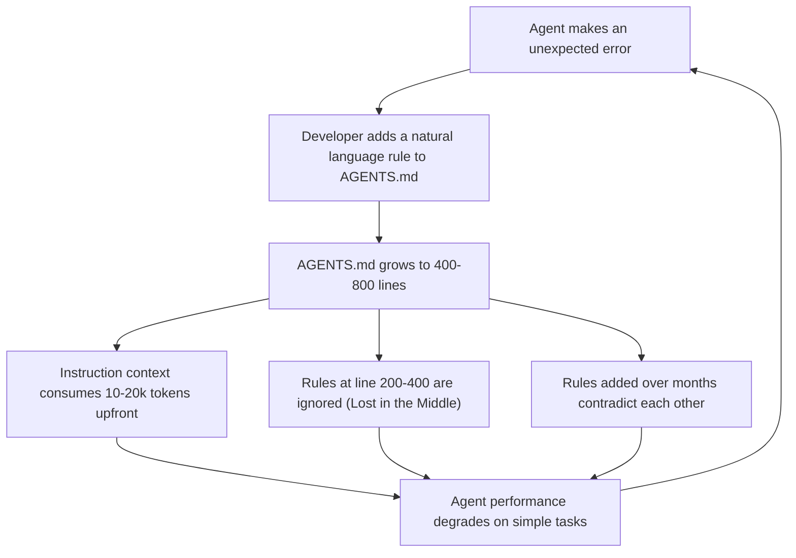
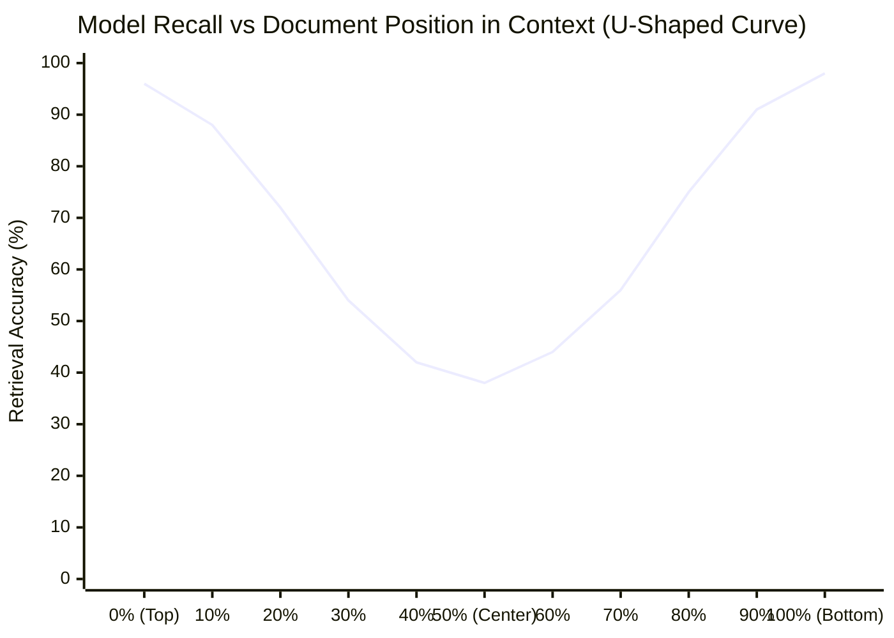
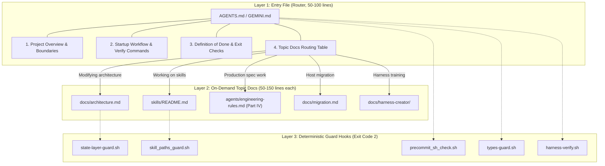
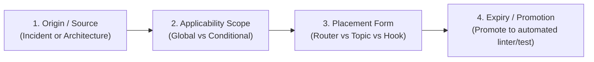

# Harness Creator Training — Lecture 4: In-Depth Progress Detail

**Topic:** Split Instructions Across Files (Why One Giant Instruction File Fails)  
**Lecture Link:** https://walkinglabs.github.io/learn-harness-engineering/en/lectures/lecture-04-why-one-giant-instruction-file-fails/  
**Target Repository:** `agent-skills-setup`  
**Date:** 2026-09-26  

---

## Part 1: The Problem — The Giant Instruction File Trap

When teams transition from zero agent scaffolding to building agent environments, they invariably stumble into the "add a rule" anti-pattern:
1. Agent makes an error (e.g., writes a bash 4 construct that breaks on macOS, or forgets to update a registry).
2. The developer immediately appends a rule to `AGENTS.md` or the system prompt: *"Always check bash version compatibility."*
3. The next day, the agent makes a different mistake: *"Remember to run tests before committing."*
4. Over months, the file balloons to 300, 500, or 800+ lines.



### The 5 Failure Modes of Monolithic Instruction Files

1. **Context Window Exhaustion:**
   An 800-line monolithic instruction file occupies 12,000–20,000 tokens. In a standard session, reading source code, inspecting diffs, running test suites, and maintaining multi-turn dialogue quickly exhausts the model's effective context, triggering early truncation or compaction.
2. **Attention Dilution ("Lost in the Middle"):**
   Transformer self-attention exhibits a U-shaped accuracy curve: information positioned at the extremes (first 10% or last 10%) has high retrieval recall, while information between 30% and 70% depth suffers severe attention degradation.
3. **Low Signal-to-Noise Ratio (SNR):**
   When an agent performs a focused task (e.g., updating a regex in a Python module), 85%+ of a monolithic instruction file (database schemas, Docker setups, Git PR conventions, Confluence rules) is noise. Processing this noise degrades generation quality and wastes inference tokens.
4. **Priority Flattening:**
   When all rules appear consecutively in the same document, the LLM cannot reliably distinguish non-negotiable security red lines (e.g., *"never write unparameterized SQL queries"*) from subjective stylistic preferences (e.g., *"prefer concise functions"*).
5. **Instruction Decay & Contradiction Accumulation:**
   Because deleting rules feels risky ("does another workflow rely on this?"), obsolete rules persist indefinitely. Conflicting instructions accumulate over time, causing the agent to behave nondeterministically.

---

## Part 2: Attention Dynamics & "Lost in the Middle"

In *Lost in the Middle: How Language Models Use Long Contexts* (Liu et al., 2023), researchers evaluated multiple state-of-the-art LLMs on multi-document question answering across varying context depths.



### Practical Implications for Harness Design:
- **Top of Document (Primacy Zone, 0%–20%):** Prime location for startup verification, critical invariant pointers, and immediate scope definition.
- **Middle of Document (Danger Zone, 20%–75%):** Lowest recall probability. Rules located here will be missed in 40–60% of runs if they rely solely on prompt instruction.
- **Bottom of Document (Recency Zone, 75%–100%):** High recall probability. Best for definition of done, pre-commit checklists, and explicit exit gates.
- **The Core Rule:** Any critical invariant that must live in the middle of a file or system prompt **MUST be enforced by a deterministic guard hook or test**, never by model attention alone.

---

## Part 3: Architecture of Progressive Disclosure

Harness engineering solves instruction bloat through **Progressive Disclosure** (the Router Pattern):



### Allocation Rules:
1. **Entry File (`AGENTS.md`):** Limited to 50–200 lines. Contains only what *every* session needs: overview, verification commands, definition of done, hard boundaries, and the topic docs routing table.
2. **Topic Documents (`docs/*.md`):** Focused, modular guides (50–150 lines). Read by the agent *only* when the task requires them.
3. **In-Code Invariants:** Class interfaces, type definitions, and schema constraints live in code (`pyproject.toml`, type annotations, JSON schemas) where the agent naturally encounters them.
4. **Deterministic Guard Hooks:** Invariants that would otherwise become fragile natural language rules are promoted to executable shell hooks (`.claude/hooks/*-guard.sh`).

---

## Part 4: Empirical SNR Audit on `agent-skills-setup`

To measure the real-world impact of instruction bloat, we developed an automated audit script ([`docs/harness-creator/lecture-04/code/split_simulation.py`](file:///Users/phoenix/projects/agent-skills-setup/docs/harness-creator/lecture-04/code/split_simulation.py)) and ran it against `agent-skills-setup`.

### Current Instruction File Footprint:
- **`AGENTS.md` (Root Router):** 82 lines, ~960 tokens.
- **`agents/engineering-rules.md` (Global System Prompt):** 147 lines, ~2,765 tokens.
- **Total Injected Entry Instructions:** 229 lines, ~3,725 tokens.
- **`docs/architecture.md` (Topic Doc):** 123 lines, ~2,047 tokens.
- **`skills/README.md` (Topic Doc):** 77 lines, ~1,112 tokens.
- **Monolithic File (Hypothetical combined):** 429 lines, ~6,884 tokens.

### Signal-to-Noise Ratio (SNR) Analysis Across 5 Canonical Tasks:

$$\text{SNR}_{\text{Token}} = \frac{\text{Signal Tokens}}{\text{Total Loaded Tokens}} \times 100\%$$

```text
| Task Name                        | Signal Lines | Total Lines | Line SNR  | Token SNR |
|----------------------------------|--------------|-------------|-----------|-----------|
| Task 1: Python Skill Bugfix      | 67           | 229         |     29.3% |     32.8% |
| Task 2: New Skill Implementation | 75           | 229         |     32.8% |     36.4% |
| Task 3: Shell Hook / Guard Mod   | 71           | 229         |     31.0% |     34.3% |
| Task 4: Fast Verification Run    | 28           | 229         |     12.2% |      6.6% |
| Task 5: Documentation Update     | 26           | 229         |     11.4% |      6.2% |
|----------------------------------|--------------|-------------|-----------|-----------|
| AVERAGE                          | 53.4         | 229         |     23.3% |     23.2% |
```

### Detailed Breakdown of Noise per Task:
- **Task 1 (Python Skill Bugfix):**
  - *Signal (32.8%):* Karpathy Rules 1–4, Guardrail Rules 5/8/9/12, Python Tooling, Verify, Definition of Done, Commit style.
  - *Noise (67.2%):* Spec-Gated 7-stage workflow (60 lines), Shell portability (4 lines), Skills symlinks (4 lines), Hook conventions (4 lines), Language conventions (5 lines).
- **Task 4 (Fast Verification Run):**
  - *Signal (6.6%):* Startup Workflow, Verify commands, Definition of Done.
  - *Noise (93.4%):* 93.4% of the loaded context has zero relevance to running verification.
- **Task 5 (Documentation / Curriculum Update):**
  - *Signal (6.2%):* Startup Workflow, End of Session state conventions, Language, Commit style.
  - *Noise (93.8%):* Shell portability, Hook conventions, Python tooling, Boundaries, Spec-gated workflow, and Mnilax rules 5–9 are pure noise.

---

## Part 5: Context Window Economics — Monolithic vs Split Simulation

If a team combines all project instructions, architectural guidelines, skill catalogs, and workflow manuals into a single monolithic `AGENTS.md` (~429 lines, 6,884 tokens), the agent must load all 6,884 tokens into its context for *every* prompt.

Under our **Router + Topic Doc** architecture, the agent loads only the Root Router (`AGENTS.md`, 960 tokens) and reads the specific topic document only when required:

```text
| Task Name                        | Monolithic Tokens  | Split Tokens  | Context Saved |
|----------------------------------|--------------------|---------------|---------------|
| Task 1: Python Skill Bugfix      |               6884 |          2072 |         69.9% |
| Task 2: New Skill Implementation |               6884 |          2072 |         69.9% |
| Task 3: Shell Hook / Guard Mod   |               6884 |          3007 |         56.3% |
| Task 4: Fast Verification Run    |               6884 |           960 |         86.1% |
| Task 5: Documentation Update     |               6884 |          3007 |         56.3% |
|----------------------------------|--------------------|---------------|---------------|
| AVERAGE SAVINGS                  |               6884 |          2224 |         67.7% |
```

### Context Window Economics:
- **Average Context Savings:** **67.7%**
- **Token Reduction per Turn:** ~4,660 tokens saved per interaction.
- Over a 20-turn development session, this saves approximately **93,200 tokens** of context space and prevents premature context compaction.

---

## Part 6: "Lost in the Middle" Vulnerability Scan & Hook Backing

We evaluated all critical repository constraints against their position depth in our files:

```text
  | Constraint Name                        | File               | Line  | Depth   | Zone         | Safety Mech     |
  |----------------------------------------|--------------------|-------|---------|--------------|-----------------|
  | Rule 1: Think Before Coding            | engineering-rules.md | 9     |   6.1% | Primacy (Top) | Model prompt    |
  | Rule 3: Surgical Changes               | engineering-rules.md | 15    |  10.2% | Primacy (Top) | Model prompt    |
  | Rule 5: Judgment Calls                 | engineering-rules.md | 25    |  17.0% | Primacy (Top) | Model prompt    |
  | Rule 12: Fail Loud                     | engineering-rules.md | 46    |  31.3% | DANGER (Middle)| Model prompt    |
  | Personal: Commit Style                 | engineering-rules.md | 53    |  36.1% | DANGER (Middle)| commit_evidence.sh |
  | Personal: Prompt Polish                | engineering-rules.md | 75    |  51.0% | DANGER (Middle)| Model prompt    |
  | Spec-Gated Workflow Gate 1-7           | engineering-rules.md | 89    |  60.5% | DANGER (Middle)| Model prompt    |
  | AGENTS: Verify Gate                    | AGENTS.md          | 22    |  26.8% | DANGER (Middle)| harness-verify.sh |
  | AGENTS: Definition of Done             | AGENTS.md          | 32    |  39.0% | DANGER (Middle)| harness-verify.sh |
  | AGENTS: Shell Portability (macOS bash 3.2)| AGENTS.md        | 48    |  58.5% | DANGER (Middle)| precommit_sh_check.sh |
  | AGENTS: Skills Symlinks                | AGENTS.md          | 52    |  63.4% | DANGER (Middle)| skill_paths_guard.sh |
  | AGENTS: Hook Conventions (Exit 2)      | AGENTS.md          | 56    |  68.3% | DANGER (Middle)| test_hook_wiring.sh |
  | AGENTS: Boundaries (Never write override)| AGENTS.md        | 66    |  80.5% | Recency (Bottom)| settings.json deny |
```

### Critical Findings:
1. **Text Prompts Alone Fail in the Middle:**
   Notice that `Shell Portability` sits at depth 58.5%, and `Skills Symlinks` sits at depth 63.4% of `AGENTS.md`. In a purely text-based agent system, these rules would be ignored whenever the agent focuses on a complex coding problem.
2. **Deterministic Guard Hooks Prevent Failure:**
   Because `agent-skills-setup` implements deterministic verification hooks (`precommit_sh_check.sh`, `skill_paths_guard.sh`, `commit_evidence.sh`, and `harness-verify.sh`), agent amnesia does not cause repository corruption. If the agent forgets to use bash 3.2 syntax, the pre-commit hook rejects the change with exit code 2 and actionable diagnostics.

---

## Part 7: Instruction Lifecycle Engineering

Lecture 4 requires managing instructions like software dependencies: every instruction must have a clear lifecycle.



### Audit Matrix of `AGENTS.md` Rules:

| Rule Section | Origin / Source | Applicability Scope | Expiry / Automation Path |
|:---|:---|:---|:---|
| **Startup Workflow** | Proactive design (Lecture 3) | Every session start | None (Core entrypoint workflow) |
| **Verify Commands** | Real incident (unverified changes) | Every change completion | Automated via `harness-verify.sh` & Stop hooks |
| **Definition of Done** | Real incident (declaring victory early)| Completion gate | Automated via `init.sh` exit code |
| **Shell Portability** | Real incident (BSD vs GNU bash crash)| Any `.sh` script modification | Automated via `precommit_sh_check.sh` / shellcheck |
| **Skills Symlinks** | Real incident (broken agent symlinks) | Modifying `skills/` or `registry` | Automated via `skill_paths_guard.sh` |
| **Hook Conventions** | Real incident (exit 1 vs 2 bypass) | Editing hooks or tests | Automated via `test_hook_wiring.sh` |
| **Python Tooling** | Real incident (mypy per-file import bugs)| Any `.py` file modification | Automated via `types-guard.sh` |
| **Boundaries (Scope)** | Real incident (overwritten `.claude/`) | Modifying repo config | Enforced via `.claude/settings.json` permissions deny |

> **Takeaway:** In a mature harness, **100% of hard constraints have a documented origin and an automated verification path**.

---

## Part 8: Relationship to Project 02 (Agent-Readable Workspace)

In Project 02 ("Agent-readable workspace"), the same architectural principle applies across development sessions:
- **Starter Workspace Anti-Pattern:** A monolithic, underspecified repository where a second agent session (Session B) has to re-read the entire git log, grep every file, and guess what Session A completed.
- **Solution Workspace Pattern:**
  - `session-handoff.md` / `PROGRESS.md` provides an immediate router to the current state.
  - `ARCHITECTURE.md` and `PRODUCT.md` provide focused topic documents that explain boundaries and specifications on demand.
  - `feature_list.json` provides machine-readable truth.
- When an agent lands in Session B, it does not re-parse hundreds of files or re-run discovery from scratch; it reads the handoff router and continues work with minimal context overhead.

---

## Part 9: Verification Evidence & Harness Pass Confirmation

All changes in this lecture were verified against the full repository harness:

1. **Standalone Simulation Verification:**
   ```bash
   python3 docs/harness-creator/lecture-04/code/split_simulation.py
   # Executed successfully: Exit code 0, generated complete SNR, savings, and middle-depth metrics.
   ```

2. **Fast Test Suite:**
   ```bash
   bash scripts/run-tests.sh --fast
   # Results: 54 passed, 0 failed, 0 skipped, 0 code-bearing subcommands without tests.
   ```

3. **Full Harness Verification (8/8 Gates):**
   ```bash
   bash scripts/harness-verify.sh
   # === harness verify ===
   #   OK    registry
   #   OK    types
   #   OK    tests
   #   OK    skill paths
   #   OK    cred backends
   #   OK    hook wiring
   #   OK    state layer
   #   OK    secret scan
   # All gates passed.
   ```
