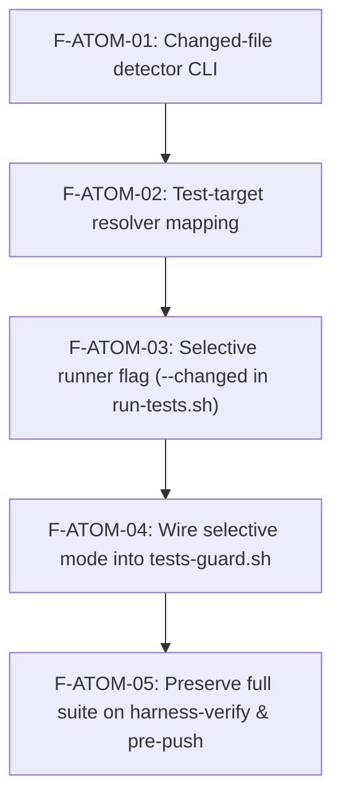

# Exercise 1: Task Atomization — Scoped Test Execution for Stop Gate

**Target Requirement:** Scope Stop gate's tests to changed files so completion stops take seconds rather than ~3 minutes (`PROGRESS.md:172`).

---

## 1. DAG Decomposition & Scope Surface

---

## 2. Atomic Work Units (WIP=1 Enforced)

### Unit 1: `F-ATOM-01` — Changed-file detector
* **Behavior:** Given git working tree status, emit relative paths of all modified/staged/untracked files.
* **Verification Command:** `bash scripts/tests/test_changed_files_detector.sh`
* **Dependencies:** None
* **Status:** `not_started`
* **Allowed Paths:** `scripts/get-changed-files.sh`, `scripts/tests/test_changed_files_detector.sh`

### Unit 2: `F-ATOM-02` — Test-target resolver
* **Behavior:** Map source file changes to corresponding test files (`scripts/tests/test_*.sh`, `tests/test_*.py`, `skills/**/test_*`). Trigger full fallback on infra modifications (`scripts/_lib.sh`, `scripts/run-tests.sh`, `.python-version`).
* **Verification Command:** `python3 -m pytest tests/test_resolve_test_targets.py`
* **Dependencies:** `F-ATOM-01`
* **Status:** `not_started`
* **Allowed Paths:** `scripts/resolve_test_targets.py`, `tests/test_resolve_test_targets.py`

### Unit 3: `F-ATOM-03` — Selective test runner flag
* **Behavior:** `scripts/run-tests.sh --changed` accepts mapped test targets and executes only selected tests, reporting targeted pass/fail counts.
* **Verification Command:** `bash scripts/run-tests.sh --fast --changed`
* **Dependencies:** `F-ATOM-02`
* **Status:** `not_started`
* **Allowed Paths:** `scripts/run-tests.sh`, `scripts/tests/test_run_tests_changed.sh`

### Unit 4: `F-ATOM-04` — Wire selective mode into Stop gate
* **Behavior:** Update `.claude/hooks/tests-guard.sh` to call `scripts/run-tests.sh --fast --changed`. Stops on single-file edits execute in <10s.
* **Verification Command:** `bash .claude/hooks/tests-guard.sh`
* **Dependencies:** `F-ATOM-03`
* **Status:** `not_started`
* **Allowed Paths:** `.claude/hooks/tests-guard.sh`, `.claude/hooks/tests/test_tests_guard.sh`

### Unit 5: `F-ATOM-05` — Invariant preservation on full gates
* **Behavior:** Verify that `scripts/harness-verify.sh`, CI workflows, and manual `./init.sh` invocations always retain the full, unpruned verification suite.
* **Verification Command:** `bash scripts/harness-verify.sh`
* **Dependencies:** `F-ATOM-04`
* **Status:** `not_started`
* **Allowed Paths:** `scripts/harness-verify.sh`, `docs/architecture.md`

---

## 3. WIP=1 Rule Validation

Under WIP=1:
1. `F-ATOM-01` is marked `active`. Units 2–5 remain `not_started` / `blocked`.
2. No file outside `F-ATOM-01`'s allowed paths may be created or edited.
3. Only when `bash scripts/tests/test_changed_files_detector.sh` exits 0 may `F-ATOM-01` be marked `passing` and committed.
4. `F-ATOM-02` is unlocked and marked `active`.
